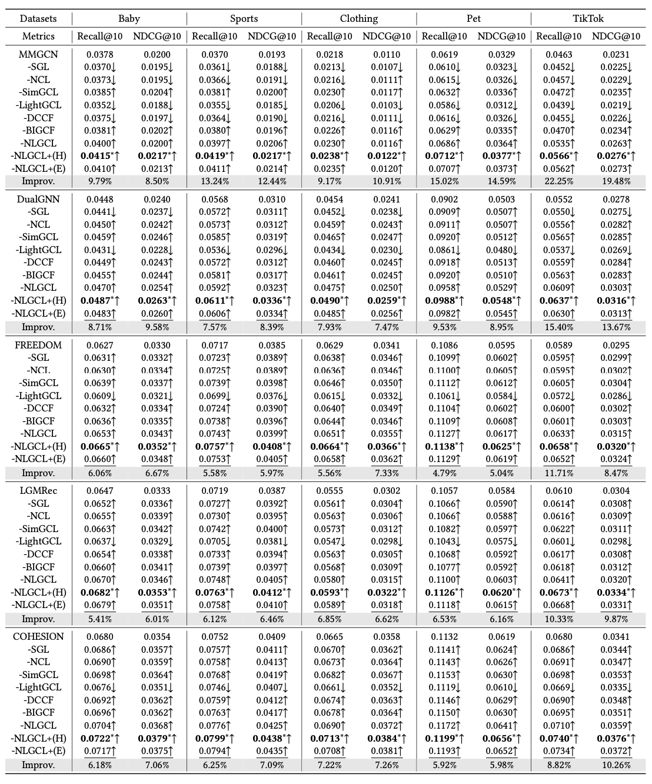

# NLGCL+: Naturally Existing Neighbour Layers Graph Contrastive Learning with Adaptive Sample Weighting for Multimodal Recommendation

<!-- PROJECT LOGO -->

## Introduction

This is the Pytorch implementation for our NLGCL+ paper:

>NLGCL+: Naturally Existing Neighbour Layers Graph Contrastive Learning with Adaptive Sample Weighting for Multimodal Recommendation

## Environment Requirement
- Python 3.9
- Pytorch 2.1.0

## Dataset

All experiments conducted on five processed datasets: Baby, Sports, Clothing, Pet, TikTok

## Model

We provide five state-of-the-art multimodal recommendation models, along with their versions enhanced by NLGCL+.

* [MMGCN ](https://dl.acm.org/doi/pdf/10.1145/3343031.3351034) and MMGCN-plus

* [DualGNN](https://ieeexplore.ieee.org/abstract/document/9662655) and DualGNN-plus

* [FREEDOM](https://arxiv.org/pdf/2211.06924) and FREEDOM-plus

* [LGMRec](https://arxiv.org/pdf/2312.16400) and LGMRec-plus
* [COHESION](https://arxiv.org/pdf/2504.04452) and COHESION-plus


## Running
  ```
  cd ./src
  python main.py -m [Model] -d [Dataset]
  ```

## Performance Comparison



## Citing NLGCL+ and NLGCL (RecSys2025 Spotlight Oral)

If you find NLGCL+ useful in your research, please consider citing our [paper]().

```
1. NLGCL+


2. NLGCL (RecSys2025 Spotlight Oral)
@inproceedings{xu2025nlgcl,
  title={NLGCL: Naturally Existing Neighbor Layers Graph Contrastive Learning for Recommendation},
  author={Xu, Jinfeng and Chen, Zheyu and Yang, Shuo and Li, Jinze and Wang, Hewei and Wang, Wei and Hu, Xiping and Ngai, Edith},
  booktitle={Proceedings of the Nineteenth ACM Conference on Recommender Systems},
  pages={319--329},
  year={2025}
}
```


## Acknowledgement

This is an extended version of [NLGCL](https://github.com/Jinfeng-Xu/NLGCL) that mainly explores its benefit as a pluggable component in multimodal recommendation

The structure of this code is  based on [MMRec](https://github.com/enoche/MMRec). Thank for their work.
